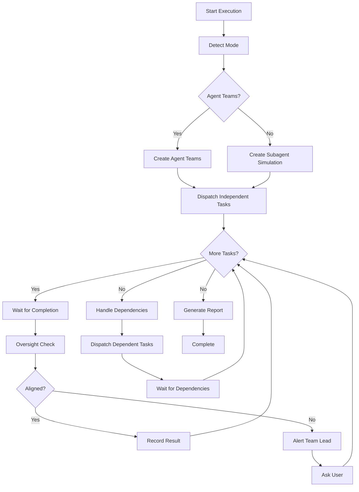

# Executing as Team

## Overview

Execute implementation plans with parallel Teammates:
1. Detect Agent Teams availability
2. Create appropriate execution mode
3. Dispatch tasks to Teammates
4. Monitor via Oversight Agent
5. Handle failures and dependencies

**This is the core execution skill for Teams mode.**

## When to Use

Use this skill **AFTER plan approval** when:
- Implementation plan is complete (from `writing-plans-for-teams`)
- Teams mode is enabled
- Ready to start parallel execution

## Prerequisites

### Required Setup

1. **Plan document** must include:
   - Teams mode enabled
   - Teammate count (adaptive or fixed)
   - Task list with goal tags
   - Dependencies marked

2. **Oversight Agent** should be available:
   - If using Agent Teams: Oversight is part of the team
   - If using Subagent: Provide oversight instance

### Required Skills

- **superpowers:using-git-worktrees** - Should be used before starting
- **superpowers:test-driven-development** - Subagents should use TDD
- **superpowers:goal-alignment-monitor** - Used by Oversight Agent

## The Process

### Step 1: Mode Detection

```javascript
const { detectAgentTeamsMode } = require('../scripts/teams-helpers/detect-mode');
const mode = detectAgentTeamsMode();

if (mode.mode === 'agent-teams') {
  // Use Claude Code Agent Teams API
  await executeWithAgentTeams(plan, teammateCount);
} else {
  // Fallback to Subagent simulation
  await executeWithSubagents(plan, teammateCount);
}
```

### Step 2: Initialize Team

```javascript
const { TeamDispatcher } = require('./lib/dispatcher');
const { TeamManager } = require('./lib/team-manager');

// Create dispatcher
const dispatcher = new TeamDispatcher(plan, teammateCount);

// Create manager (with oversight if available)
const manager = new TeamManager(plan, teammateCount, oversight);
```

### Step 3: Parallel Dispatch

```javascript
const { groupTasksForTeams } = require('../scripts/teams-helpers/task-grouping');

// Group tasks
const groups = groupTasksForTeams(plan.tasks);

// Dispatch independent tasks to Teammates
for (let i = 0; i < teammateCount && i < groups.independent.length; i++) {
  const task = groups.independent[i];
  await manager.dispatchAndMonitor(task);
}
```

### Step 4: Oversight Integration

```javascript
// Each task completion triggers alignment check
teammate.on('complete', async (result) => {
  const alignment = await oversight.checkAlignment({
    taskId: result.taskId,
    code: result.changes,
    tests: result.tests,
    goalTags: result.goalTags
  });

  if (alignment.status === 'aligned') {
    // Task aligned, continue
    console.log(`Task ${result.taskId} aligned`);
  } else {
    // Misalignment detected
    await handleMisalignment(result, alignment);
  }
});
```

### Step 5: Dependency Management

```javascript
// Handle task failure
if (result.status === 'failed') {
  const groups = groupTasksForTeams(plan.tasks);
  const dependents = getDependentTasks(result.taskId, groups.dependencyGraph);

  if (dependents.length > 0) {
    // Block dependent tasks
    await pauseTeam({
      reason: 'Task dependency failure',
      blockedTasks: dependents
    });

    // Ask user for decision
    await askUser({
      message: `Task ${result.taskId} failed. Blocked: ${dependents.join(', ')}`,
      options: [
        { label: 'Retry', action: 'retry' },
        { label: 'Modify task', action: 'modify' },
        { label: 'Skip and continue', action: 'skip' },
        { label: 'Abort', action: 'abort' }
      ]
    });
  }
}
```

## Execution Flow



## Team Configuration

### Teammate Count

| Count | Use Case |
|-------|----------|
| 1 | Sequential, debugging |
| 2-3 | Small parallel work |
| 4-5 | Large tasks, good for CI/CD |

### Task Types

**Independent Tasks:**
- Can run in parallel
- No shared dependencies
- Examples: utility functions, different modules

**Dependent Tasks:**
- Must run sequentially
- Depend on previous outputs
- Examples: integration, tests after code

## Error Handling

### Failure Scenarios

| Scenario | Handling |
|----------|----------|
| Task fails | Check dependencies, ask user |
| Dependency fails | Block dependent tasks, ask user |
| Teammate unavailable | Retry or redistribute |
| Oversight timeout | Skip check or use cache |

### User Intervention Points

1. **Task Failure:** Ask to retry/modify/skip/abort
2. **Misalignment:** Ask to adjust/ignore
3. **Team Issues:** Ask to continue/stop

## Monitoring

### Real-time Status

```javascript
const status = dispatcher.getStatus();
console.log(`
Teammates: ${status.teammateCount}
Active: ${status.teammates.filter(t => t.status === 'working').length}
Idle: ${status.teammates.filter(t => t.status === 'idle').length}
Completed: ${status.completedTasks}/${status.totalTasks}
`);
```

### Progress Reporting

After each task completion:
```
✓ Task 3 completed (aligned)
  - Files: src/auth/token.js, tests/auth/token.test.js
  - Tests: 3/3 passing
  - Coverage: 95%

Progress: 3/8 tasks (37.5%)
Aligned: 3 | Misaligned: 0
```

## Integration Points

- **Before:** `writing-plans-for-teams` (plan with goal tags)
- **During:** `test-driven-development` (subagent implementation)
- **Monitoring:** `goal-alignment-monitor` (Oversight checks)
- **After:** `finishing-a-development-branch` (completion)

## Common Mistakes

### ❌ Wrong Teammate Count

**Wrong:** Always using 5 teammates
**Right:** Use adaptive or match to independent task count

### ❌ Ignoring Dependencies

**Wrong:** Dispatching all tasks at once
**Right:** Group tasks, dispatch independently first

### ❌ Skipping Oversight

**Wrong:** Not running alignment checks
**Right:** Always run Oversight on each task

### ❌ Not Asking User

**Wrong:** Auto-retrying failed tasks
**Right:** Ask user for decision on failures

## Example Workflow

```
You: Starting execution with 3 teammates.

[Mode detection: Subagent fallback]

[Dispatching independent tasks]
✓ Task 1: Setup project (Teammate 1)
✓ Task 5: Utils module (Teammate 2)
✓ Task 6: API helpers (Teammate 3)

[Oversight checks]
✓ Task 1 aligned (architecture: standard)
✓ Task 5 aligned (style: functional)
✓ Task 6 aligned (style: functional)

[Handling dependent tasks]
→ Waiting for Task 1: Task 2 (depends on Task 1)
→ Waiting for Task 1: Task 3 (depends on Task 1)

[Dispatching dependent tasks]
✓ Task 2: Auth service (Teammate 1)
...

[Completion]
All 8 tasks completed
Aligned: 8 | Misaligned: 0
```

## Validation Checklist

Before starting execution:
- [ ] Teams mode enabled in plan
- [ ] Teammate count set
- [ ] All tasks have goal tags
- [ ] Dependencies marked
- [ ] Oversight agent available
- [ ] Git worktree created
