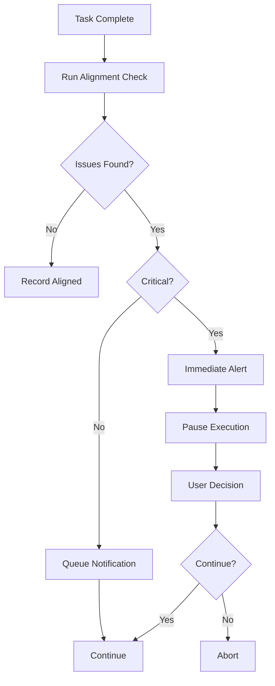

# Goal Alignment Monitor

## Overview

Monitor goal alignment for Teams mode:
1. Automatic checks after each task completion
2. Milestone checks at key points
3. Alert Team Lead on misalignment
4. Generate progress reports

**This skill is used EXCLUSIVELY by the Oversight Agent in Teams mode.**

## When to Use

Use this skill **DURING task execution** when:
- A task completes and needs alignment check
- A milestone is reached
- Requested by Team Lead for status check

## The Process

### Per-Task Check

```javascript
const { AlignmentChecker } = require('./lib/checkers');

const checker = new AlignmentChecker();

const alignment = await checker.checkAll({
  code: codeChanges,
  files: modifiedFiles
}, {
  testResults,
  coverage
}, {
  architecture: goalTags.architecture,
  style: goalTags.codeStyle,
  testing: goalTags.testing,
  performance: goalTags.performance,
  security: goalTags.security
});

return {
  status: alignment.passed ? 'aligned' : 'misaligned',
  issues: alignment.issues,
  critical: alignment.critical
};
```

### Milestone Check

```javascript
const { generateMilestoneReport } = require('./lib/alert-system');

const report = await generateMilestoneReport({
  taskResults: completedTasks,
  goals: goalMetrics,
  milestoneName: 'Phase 1 Complete'
});

return report;
```

## Check Types

### Architecture Check

| Goal | Checks |
|------|--------|
| microservices | Circular dependencies, service boundaries |
| monolithic | External APIs, module cohesion |
| functional | Mutable globals, side effects |

### Style Check

| Goal | Checks |
|------|--------|
| functional | Classes, side effects |
| OOP | Functional patterns |
| standard | Linting, formatting, naming |

### Testing Check

| Goal | Checks |
|------|--------|
| unit | Unit test count, coverage |
| integration | Integration test presence |
| e2e | E2E test presence |
| Combined | All of above + test success |

### Performance Check

| Goal | Checks |
|------|--------|
| < N ms | Response time |
| N concurrent | Concurrent capacity |

### Security Check

| Goal | Checks |
|------|--------|
| JWT | JWT implementation |
| bcrypt | Password hashing |
| standard | Secrets, injection, XSS |

## Alert System

### Alert Levels

| Level | Meaning | Action |
|-------|---------|--------|
| **Critical** | Architecture violation, security issue | Immediate notification, pause execution |
| **Warning** | Style deviation, testing gap | Batch notification |
| **Info** | Minor suggestions | Summary only |

### Alert Flow



### Alert Example

```javascript
const alert = {
  taskId: 'Task 3',
  type: 'alignment-misalignment',
  severity: 'warning',
  issues: [
    {
      category: 'style',
      message: 'Side effects detected in function',
      severity: 'warning',
      location: 'src/auth/token.js:45'
    }
  ]
};

await alertSystem.sendAlert(alert);
```

## Milestone Reporting

### Generate Report

```javascript
const report = await generateMilestoneReport({
  taskResults: completedTasks,
  goals: {
    architecture: 'microservices',
    style: 'functional',
    testing: 'unit+integration'
  },
  milestoneName: 'Phase 1: Core Services'
});
```

### Report Structure

```markdown
## Milestone Report: Phase 1: Core Services

**Timestamp:** 2026-02-07T00:30:00Z

### Summary
- Total Tasks: 5
- Aligned: 4 (80%)
- Misaligned: 1 (20%)
- Score: 80%

### Goal Achievements
- Architecture (microservices): 3/3 (100%)
- Style (functional): 2/3 (67%)
- Testing (unit+integration): 4/4 (100%)

### Status: Partial Alignment

### Recommendations
- [High] Fix Task 3: Side effects in token.js
- [Medium] Review functional style compliance

### Task Details
| Task | Status | Issues |
|------|--------|--------|
| Task 1 | Aligned | 0 |
| Task 2 | Aligned | 0 |
| Task 3 | Misaligned | 1 |
| Task 4 | Aligned | 0 |
| Task 5 | Aligned | 0 |
```

## Integration Points

- **Called By:** `executing-as-team` (after each task)
- **Uses:** `scripts/teams-helpers/goal-tags.js` (parse goals)
- **Outputs:** Alerts to main session, milestone reports

## Common Mistakes

### ❌ Not Running Checks

**Wrong:** Skipping alignment check
**Right:** Always run check on task completion

### ❌ Wrong Alert Level

**Wrong:** Marking style issue as critical
**Right:** Reserve critical for architecture/security

### ❌ No Milestone Reports

**Wrong:** Only checking per-task
**Right:** Generate milestone reports at key points

## Example Usage

### Quick Check

```javascript
// Check a completed task
const result = await goalMonitor.checkTask({
  taskId: 'Task 5',
  code: fileChanges,
  tests: { passed: 5, failed: 0, coverage: 92 },
  goalTags: {
    architecture: 'functional',
    testing: 'unit'
  }
});

console.log(result.status); // 'aligned' or 'misaligned'
```

### Milestone Report

```javascript
// Generate report at phase completion
const report = await goalMonitor.generateReport({
  tasks: completedTasks,
  goals: designGoalMetrics,
  name: 'Authentication Complete'
});

console.log(report.score); // 85%
console.log(report.recommendations); // Array of suggestions
```

### Alert History

```javascript
// Get all critical alerts
const critical = alertSystem.getHistory({
  severity: 'critical'
});

console.log(critical);
// [{ id: 'alert-...', taskId: 'Task 3', ... }]
```

## Validation Checklist

Before using skill:
- [ ] Goal tags are defined in task
- [ ] Code changes are available
- [ ] Test results are available
- [ ] Alert system is initialized
